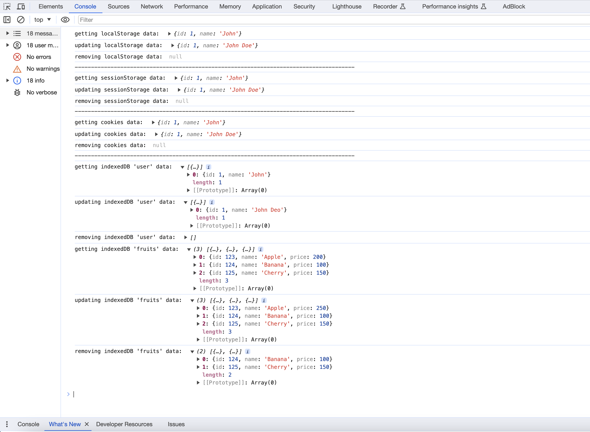

# lionxStorage
[](https://www.npmjs.com/package/lionxstorage)
[](https://npm-stat.com/charts.html?package=lionxstorage)
[](https://github.com/prettier/prettier)
[](https://cdn.jsdelivr.net/npm/lionxstorage@0.1.7/dist/lionxstorage.js)

[](https://opensource.org/licenses/MIT)


lionxStorage is a Javascript and React library that provides a unified interface for storing and retrieving data using various storage mechanisms such as `localStorage`, `sessionStorage`, `cookies`, and `indexedDB`. It is designed to work seamlessly in both Javascript and React environments.

See the [examples folder](https://github.com/vivekmengu016/lionxstorage/blob/main/examples) for more examples

<br/>

## Installation

You can install lionxStorage via npm:

```bash
npm install lionxstorage --save
```

or To use lionxStorage in HTML, just drop a single Javascript file into your page:

```html
<script src="https://cdn.jsdelivr.net/npm/lionxstorage@latest/dist/lionxstorage.js"></script>
<script>
  // Create an instance with the desired storage type
  const storeData = new lionxStorage('localStorage');
  storeData.set('key', 'value');

  // Get data
  console.log( storeData.get('key') ); // Output: 'value'

</script>
```

## 🌱 API

lionxStorage simplifies data management with a consistent API across various storage types. Use `storeData.set` to store data, `storeData.get` to retrieve it, `storeData.update` to modify, and `storeData.remove` to delete. This uniform API design, applicable to different storage types, promotes ease of use and ensures a hassle-free experience for developers.

Here is a list of lionxStorage API interfaces along with their respective arguments and detailed explanations.

### 🔸 ``` storeData.set(key, value, options) ```
  - Sets a key-value pair in the storage
    1. `key: string` **[Required]** The unique identifier (string) under which the value will be stored.
    2. `value: string|Date|Number|Object|Boolean|Null` **[Required]** The data of any type that you want to associate with the key.
    3. `options: Object` **[optional]** Additional options for storage (e.g., expiration, path for cookies).


### 🔸 ``` storeData.get(key) ```
  - Retrieves the value associated with the specified key.
    1. `key: string`: The unique identifier (string) for which the associated value will be retrieved. 
  

### 🔸 ``` storeData.update(key, value) ```
  - Updates the value associated with the specified key.
    1. `key: string` **[Required]** The unique identifier (string) of the data to be updated.
    2. `value: string|Date|Number|Object|Boolean|Null` **[Required]** The new data of any type that will replace the existing value.
  

### 🔸 ``` storeData.remove(key) ```
  - Removes the data associated with the specified key.
    1. `key: string` **[Required]** The unique identifier (string) for which the associated data will be removed. 

<br/>


## 🔥 Usage in React Environment

```jsx
import React from 'react';
import lionxStorage from 'lionxstorage';

const ExampleComponent = () => {
  // Create an instance with the desired storage type
  const storeData = new lionxStorage('localStorage');

  // Set data
  storeData.set('user', { name: "john" });

  // Get data
  const storedValue = storeData.get('user');

  return (
    <div>
      <p>Stored Value: {storedValue.name}</p>
    </div>
  );
};
```

## 🌟 Supported Storage Types

Each storage type serves specific purposes, and choosing the right one depends on factors like data size, persistence requirements, and the need for advanced querying capabilities. Consider the characteristics of each storage type to make informed decisions based on your application's requirements.

  1. [localStorage](#localstorage)
  2. [sessionStorage](#sessionstorage)
  3. [cookies](#cookies)
  4. [indexedDB](#indexeddb)

### <a id="localstorage"> localStorage: </a>

**Description :** Provides persistent storage with a capacity of approximately 5 MB, allowing data to persist across browser sessions.

**Use Case :** Ideal for storing critical data that needs to persistently survive browser closures, such as user preferences, settings, or cached data for quicker page loading.

#### Example Usage

```javascript
// Example usage for localStorage
const localStorageSDK = new lionxStorage("localStorage");

localStorageSDK.set("user", { id: 1, name: "John" });
console.log(localStorageSDK.get("user"));

localStorageSDK.update("user", { id: 1, name: "John Doe" });
console.log(localStorageSDK.get("user"));

localStorageSDK.remove("user");
console.log(localStorageSDK.get("user"));
```
<br/>

---

### <a id="sessionstorage"> sessionStorage: </a>

**Description :** Similar to localStorage, but data is cleared when the session ends, offering a temporary solution for session-specific information.

**Use Case :** Suitable for scenarios where data needs to be retained only during the current session, ensuring privacy and cleanliness after the user logs out or closes the tab.

#### Example Usage

```javascript
// Example usage for sessionStorage
const sessionStorageSDK = new lionxStorage("sessionStorage");

sessionStorageSDK.set("user", { id: 1, name: "John" });
console.log(sessionStorageSDK.get("user"));

sessionStorageSDK.update("user", { id: 1, name: "John Doe" });
console.log(sessionStorageSDK.get("user"));

sessionStorageSDK.remove("user");
console.log(sessionStorageSDK.get("user"));
```
<br/>

---

### <a id="cookies"> cookies: </a>

**Description :** Stores data using browser cookies, making it available for each HTTP request sent to the server.

**Use Case :** Used for managing user authentication tokens, tracking user behavior, or maintaining small pieces of state information across requests, providing a reliable method for client-server communication.

#### Example Usage

```javascript
// Example usage for cookies
const cookiesSDK = new lionxStorage("cookies");

cookiesSDK.set("user", { id: 1, name: "John" });
console.log(cookiesSDK.get("user"));

cookiesSDK.update("user", { id: 1, name: "John Doe" });
console.log(cookiesSDK.get("user"));

cookiesSDK.remove("user");
console.log(cookiesSDK.get("user"));
```

<br/>

---

### <a id="indexeddb"> indexedDB: </a>

**Description :** Asynchronous storage with a larger capacity and more complex querying capabilities, designed for advanced data manipulation.

**Use Case :** Suited for applications requiring advanced querying, indexing, and offline data storage. Ideal for complex web applications, data-intensive projects, or scenarios where structured data needs efficient management.


When utilizing indexedDB with lionxStorage, there are additional parameters and initialization steps to consider for a seamless experience.

#### Initialization
```javascript
// Create an instance of lionxStorage for indexedDB
const indexedDB = new lionxStorage("indexedDB", "my_database", 1);

// Initialize the indexedDB store, specifying the object store names in an array
indexedDB.init(["user_data_store"]);
```
  - **Description:** To begin using indexedDB with lionxStorage, create an instance with the desired database name, object store name, and version. The init method is then used to initialize the specified object stores, allowing seamless data operations.

#### Example Usage

```javascript
// Example usage for IndexedDB
const indexedDBSDK = new lionxStorage("indexedDB", "userData", 1);

async function indexedDBStorage() {
  try {
    indexedDBSDK.init(["user", "fruits"]); // here we can pass multiple stores names to create all at once
    

    // Operations performing on "USER" store
    indexedDBSDK.set("user", { id: 1, name: "John" });
    console.log(await indexedDBSDK.get("user"));

    indexedDBSDK.update("user", { id: 1, name: "John Deo" });
    console.log(await indexedDBSDK.get("user"));

    indexedDBSDK.remove("user", 1); // pass the id: value
    console.log(await indexedDBSDK.get("user"));


    // Operations performing on "FRUITS" store
    indexedDBSDK.set("fruits", { id: 123, name: "Apple", price: 200 });
    indexedDBSDK.set("fruits", { id: 124, name: "Banana", price: 100 });
    indexedDBSDK.set("fruits", { id: 125, name: "Cherry", price: 150 });

    console.log(await indexedDBSDK.get("fruits"));

    indexedDBSDK.update("fruits", { id: 123, price: 250 });
    console.log(await indexedDBSDK.get("fruits"));

    indexedDBSDK.remove("fruits", 123); // pass the id: value
    console.log(await indexedDBSDK.get("fruits"));


  } catch (error) {
    console.log("IndexedDB caught error : ", error);
  }
}

indexedDBStorage();
```

 - **NOTE:** For indexedDB, always provide a unique ID when creating data; this ID serves as the key for data retrieval, updates, and deletions. For eg: ```{ id: 123, ...}```


<br/>

### Screenshot



## Need Assistance?

Lost? Need help? Try the lionxStorage API documentation

If you're facing challenges or wish to contribute to lionxStorage, check the [existing issues](https://github.com/vivekmengu016/lionxstorage/issues) to see if your concern has been addressed. If not, [please open a new issue](https://github.com//vivekmengu016/lionxstorage/issues/new) to seek help or share your insights. Your contributions and feedback are valued!

## Framework Support

lionxStorage is designed to be framework-agnostic, making it suitable for integration with various frontend frameworks and libraries. Whether you are working with React, Angular, Vue, Next.js, NuxtJs, Svelte, Remix or any other frontend framework, lionxStorage provides a consistent and easy-to-use interface for local data storage. 

Its simplicity and flexibility make it adaptable to the specific requirements of different projects and development environments.


## License

lionxStorage is licensed under the MIT License - see the [LICENSE](https://github.com/vivekmengu016/lionxstorage/blob/main/LICENSE). file for details.

---

Copyright (c) 2024 [Vivek Mengu](https://github.com/vivekmengu016)
([Contributors](https://github.com/vivekmengu016/lionxstorage/graphs/contributors)).